<h1 align="center">Reading the Floor</h1>
<p align="center"><b>A portable, calibrated, <i>federated</i> shot-quality model for the NBA — built from raw optical player-tracking.</b></p>

<p align="center">
  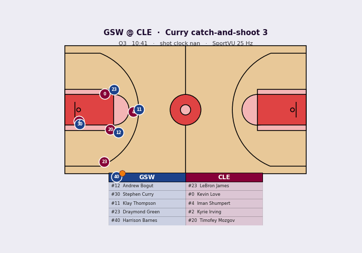
</p>

<p align="center">
  
  
  
  
  
  
</p>

---

## Summary

Converted raw optical tracking and Play by Play logs into a **calibrated model** that outputs the probability of converting the shot, using only information available *before the ball is released* and then showed that model can be **trained across all 30 teams without any team sharing its raw data** (federated learning), at a cost of just **~2.6%**.

The calibrated probability powers a suite of analytics: a **Points Over Expectation (POE)** rating for shooters and defenders, per zone and archetype matchup breakdowns, and five man **lineup** evaluation.

> Advanced MSc Artificial Intelligence thesis (Big Data Analytics), KU Leuven — *Juan Manuel Oliver*.

**Highlights**
- 🎯 **Well-calibrated** shot model: Brier **0.219**, log-loss **0.628**, ROC-AUC **0.670** on a *game-disjoint* test set, clearing the ~0.62 AUC ceiling of purely geometric models.
- 🔒 **Federated across 30 teams** (Flower + `FedXgbBagging`/`FedXgbCyclic`), measured over 5 seeds and 4 configurations, with paired bootstrap confidence intervals.
- 🧠 **Portable feature set** — release geometry, defender pressure, shooter/defender kinematics, spacing, tempo, and behavioural **archetypes** from a Gaussian Mixture Model, no dependency on NBA specific player IDs.
- 📊 **Applications**: POE leaderboards (shooters & defenders), per zone calibration, archetype matchup heatmaps, lineup POE, and spatial shot charts, ability to train model while keeping data private.
- 🧪 End-to-end, reproducible pipeline from raw `.7z` tracking archives → features → model → federated experiments → thesis figures.

---

## The problem

Some of the most valuable data in sports: practice tracking, biometrics, scheme indicators, is exactly the data teams most want to keep private. That creates a tension: build cutting edge models, *or* respect data governance. This project resolves it by pairing a **deliberately portable shot quality model** with a **cross-silo federated protocol**, so a league scale model can be trained **without any franchise surrendering its raw data**.

## How it works

<p align="center">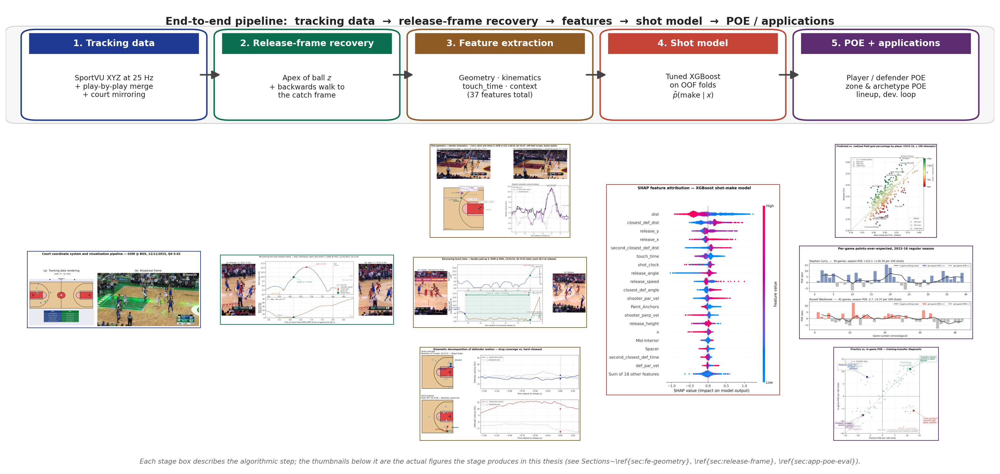</p>

Every shot is reduced to **the exact game state at the moment of release**. The hardest part is recovering that release frame from the tracking stream, the PBP timestamp trails the true release by 1–2 seconds, so I detect the ball's arc apex and walk back to the frame where it leaves the shooter's hands.

<table>
<tr>
<td width="50%">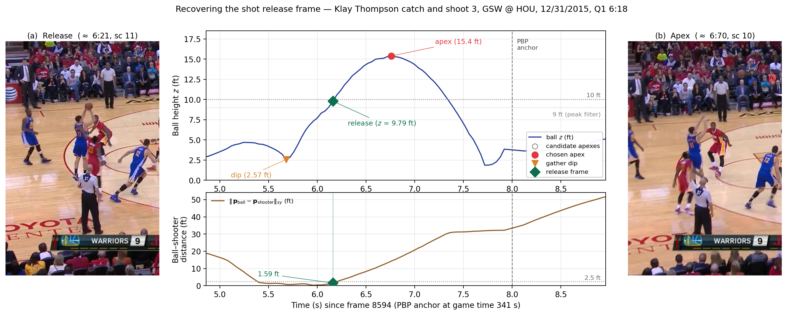</td>
<td width="50%">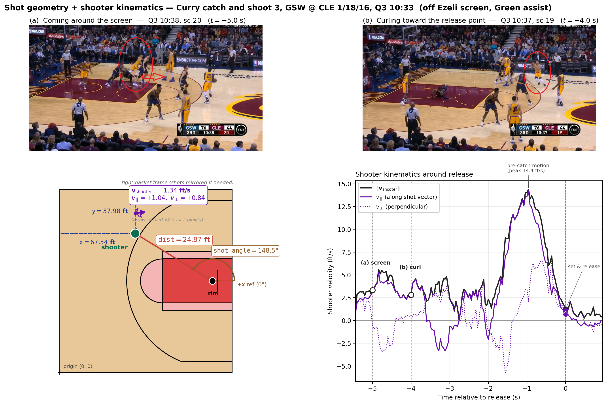</td>
</tr>
<tr>
<td align="center"><sub><b>Release frame recovery</b> from the ball's vertical trajectory.</sub></td>
<td align="center"><sub><b>Kinematics</b> decomposed parallel/perpendicular to the shot line.</sub></td>
</tr>
</table>

The feature set spans six portable families: **shot geometry**, **defender pressure** (distance, angle, closeout time, tight-contest counts), **shooter & defender kinematics**, **release mechanics** (height, speed, angle), **possession tempo** (shot clock, touch time, catch-and-shoot), **floor spacing**, and **soft player archetypes** from a GMM.

Spacing and pressure are dynamic, a kinematic **space control** model turns positions and velocities into who would reach each patch of floor first, revealing how a possession opens (and closes) the shooter's window:

<p align="center">
  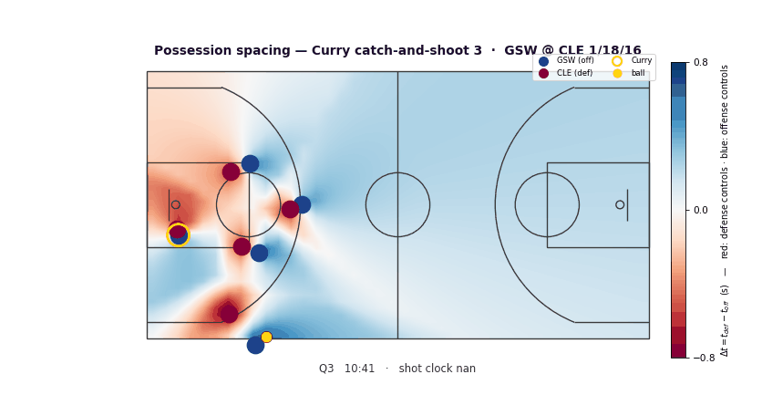
  <br><sub><b>Space control over a possession</b> — blue = offense would arrive first, red = defense. Curry (yellow ring) springs open just before the catch.</sub>
</p>

## Results

A gradient-boosted model trained with **game-disjoint** splits, no game ever spans train and test and evaluated on **probability quality**, not threshold accuracy (because everything downstream integrates the probability, not the label).

| Model | Brier ↓ | Log-loss ↓ | ROC-AUC ↑ |
|---|---|---|---|
| Constant (base rate) | 0.2475 | 0.6881 | 0.500 |
| Distance-only logistic | 0.2400 | 0.6728 | 0.603 |
| **XGBoost (full features)** | **0.219** | **0.628** | **0.670** |

<table>
<tr>
<td width="50%">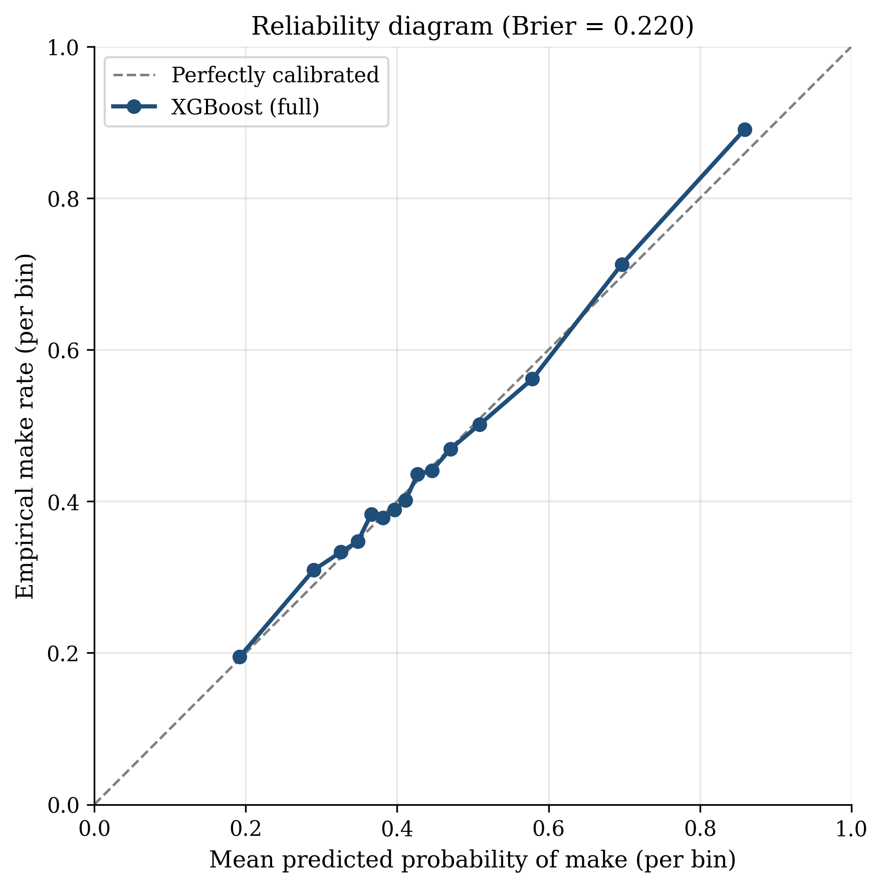</td>
<td width="50%">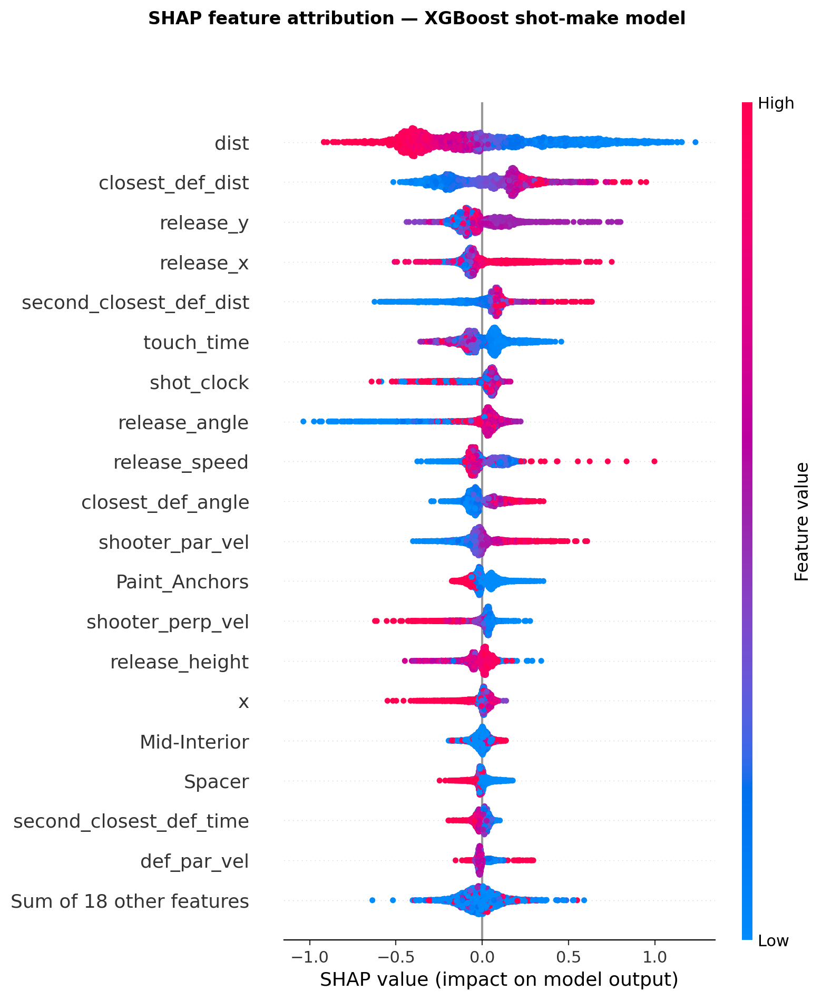</td>
</tr>
<tr>
<td align="center"><sub><b>Calibration</b> — predicted probabilities track empirical make rates.</sub></td>
<td align="center"><sub><b>What the model uses</b> — distance, then defender pressure, mechanics, archetypes.</sub></td>
</tr>
</table>

### Federated learning — the privacy cost is small

Training across the 30 teams as natural silos (non-IID by construction), the federated model stays within **~2.6%** Brier of the centralized baseline — statistically homogeneous across aggregation strategies and partitions, with all 95% paired-bootstrap CIs inside **[+2.0%, +3.2%]**.

<p align="center">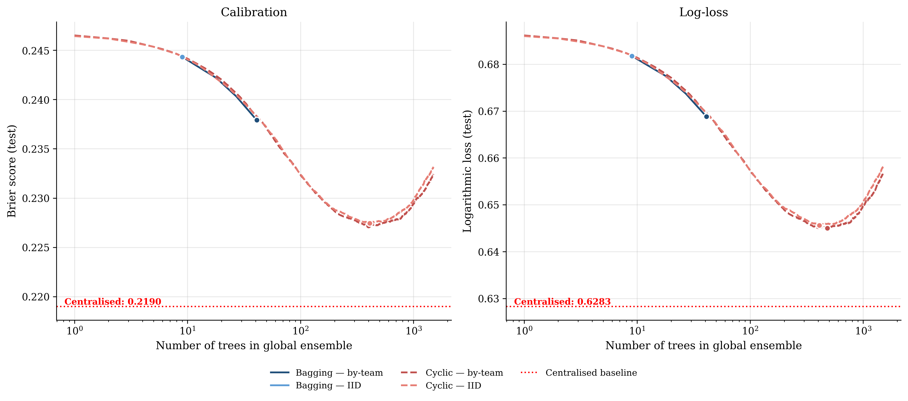</p>

## Applications — what the calibrated probability unlocks

With a trustworthy P(make), a shot's value over an average shooter in the same situation is simply `POE = value × (outcome − P(make))`, computed **out of fold** so no player is flattered by the model training on their own shots.

<table>
<tr>
<td width="50%">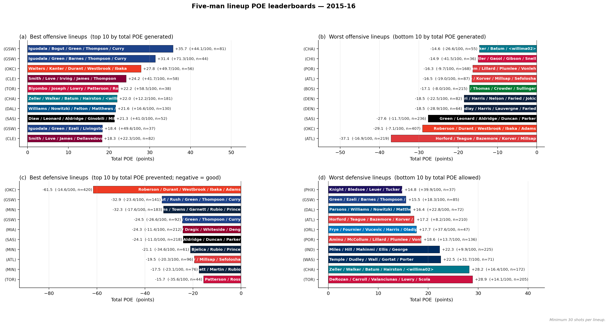</td>
<td width="50%">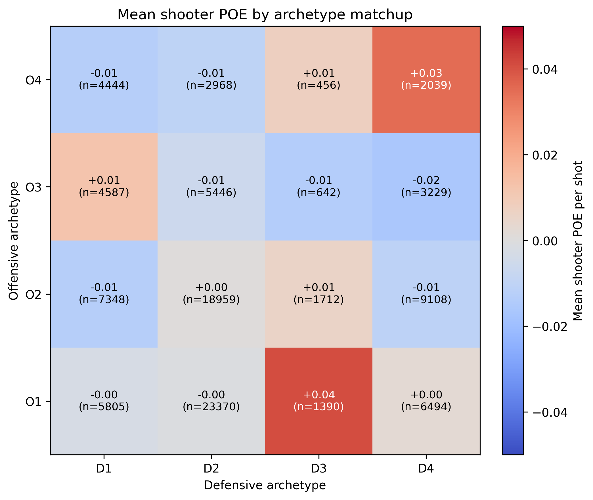</td>
</tr>
<tr>
<td align="center"><sub><b>Five-man lineup POE</b> — best/worst offensive & defensive units.</sub></td>
<td align="center"><sub><b>Archetype matchups</b> — which styles beat which.</sub></td>
</tr>
<tr>
<td width="50%">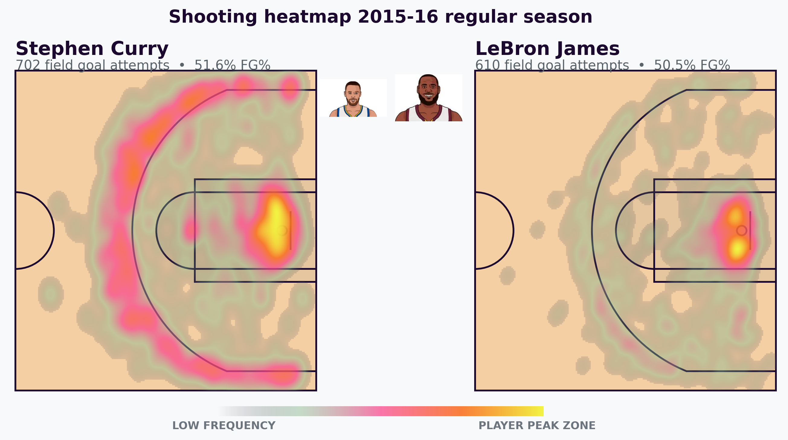</td>
<td width="50%">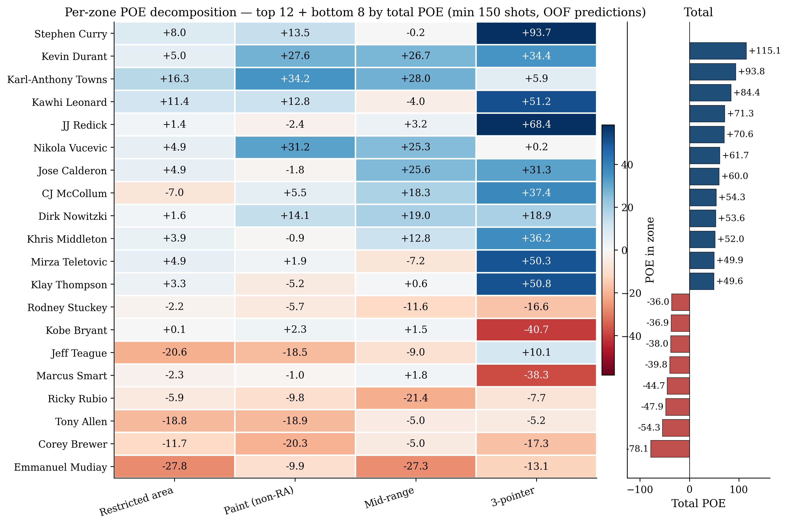</td>
</tr>
<tr>
<td align="center"><sub><b>Spatial shot charts</b> coloured by shot quality.</sub></td>
<td align="center"><sub><b>Per-zone POE</b> — where each player creates or sheds points.</sub></td>
</tr>
</table>

## Tech stack

`Python` · `XGBoost` · `scikit-learn` · `Flower` (federated learning) · `pandas`/`NumPy`/`SciPy` · `Matplotlib` · `R` (archetype clustering) · SportVU optical tracking + NBA play-by-play.

## Repository tour

```
src/                 Feature extraction, model training/tuning, POE, visualization
  shot_features.py     Release-frame recovery + 37-feature extraction per shot
  train_xgboost.py     Game-disjoint calibrated model + evaluation
  compute_poe.py       Out-of-fold Points Over Expectation
  federated/           Flower app: bagging/cyclic × team/IID, multi-seed, bootstrap CIs
clusters/            R project: GMM player-archetype clustering
figures_thesis/      Scripts that regenerate every thesis figure
docs/                Rerun runbook + dataset documentation
assets/              Figures used in this README
```


## Dataset

The engineered shot-features table (≈98k shots × 48 columns) is published as a standalone dataset. The full column dictionary and module-level details live in **[`docs/ARCHITECTURE.md`](docs/ARCHITECTURE.md)**.
📊 Kaggle: https://www.kaggle.com/datasets/juanmaoliver/shot-features/data


## About

**Juan Manuel Oliver** — MSc Artificial Intelligence (Big Data Analytics), KU Leuven.
Thesis: *Reading the Floor — A Portable Federated Shot Quality Model from Optical Tracking.*

- 🔗 LinkedIn: https://www.linkedin.com/in/juanma-oliver
- 📄 Thesis PDF: 
- 📊 Kaggle: [JuanmaOliver](https://www.kaggle.com/juanmaoliver)

<sub>Built on publicly posted SportVU tracking and NBA play-by-play data, for research and educational use. Please credit the original data sources.</sub>
