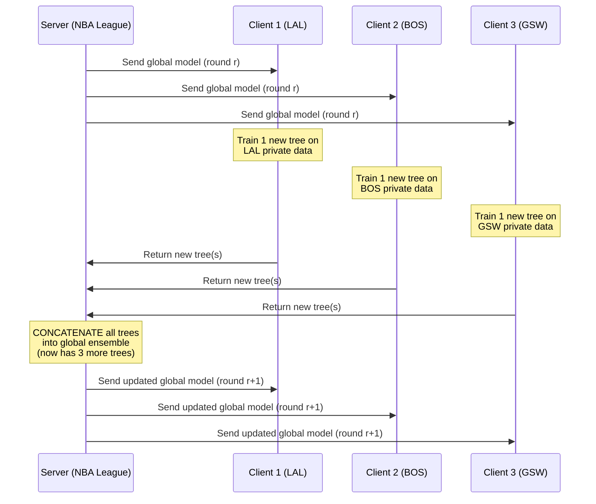
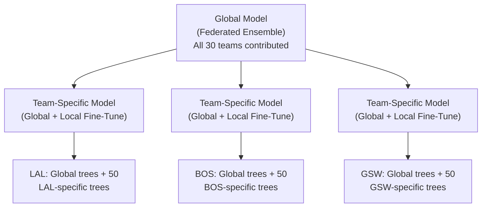

# Federated Learning for XGBoost Shot Prediction — Design Discussion

## 1. Why Federated Learning Fits This Domain

Your roadmap captures the key insight: **training data (practice sessions, proprietary tracking) is private per organization, but game data (public SportVU feeds) can be shared for evaluation.**

```
┌─────────────────────────────────────────────────────────┐
│                   The Privacy Argument                   │
├─────────────────────────────────────────────────────────┤
│  PRIVATE (per team)          │  PUBLIC (shared)          │
│  ─────────────────           │  ────────────────         │
│  • Practice tracking data    │  • Official game tracking │
│  • Shooting drill metrics    │  • Play-by-play logs      │
│  • Injury/fatigue signals    │  • Box scores             │
│  • Scouting reports          │  • Published stats        │
│  • Smart device data         │  •                        │
│    (Smart Basketball/Ring)   │                           │
└─────────────────────────────────────────────────────────┘
```

In a traditional centralized approach, all 30 NBA teams would need to pool their raw data into a single server. No team would agree to this — it exposes competitive advantages. **Federated learning lets each team train locally on their private data and only share model updates (trees), never the raw data.**

---

## 2. The XGBoost Challenge: Trees ≠ Neural Network Weights

> [!IMPORTANT]
> Federating XGBoost is fundamentally different from federating a neural network. With deep learning, you average gradient updates (FedAvg). With XGBoost, **there are no continuous weights to average** — you have discrete decision trees.

Flower supports two strategies for federated XGBoost:

### Strategy A: Bagging Aggregation (`FedXgbBagging`) — ✅ Recommended



**How it works:**
- Each client trains **1 tree per round** on their local data (using the residuals from the current global model)
- The server **concatenates** (not averages!) all client trees into the global ensemble
- After R rounds with N clients → global model has **R × N trees**

**Why it fits your use case:**
- Parallel: all teams train simultaneously
- Each team's signal on unique shooting patterns gets captured by dedicated trees
- The final ensemble naturally covers diverse shooting contexts

### Strategy B: Cyclic Training (`FedXgbCyclic`)

```
Round 1: Server → LAL trains → sends model → 
Round 2: Server → BOS trains on LAL's model → sends model →
Round 3: Server → GSW trains on LAL+BOS model → sends model →
Round 4: Server → LAL trains on previous model → ...
```

- Only **1 client per round** — sequential, round-robin
- Slower convergence but simpler
- Risk: model may overfit to the last team that trained

> [!TIP]
> **Recommendation for your thesis:** Use **Bagging** as the primary strategy. It's parallelizable, more robust, and maps naturally to the real-world scenario where all teams train independently between games. You can include Cyclic as a comparison in your experiments.

---

## 3. Data Partitioning Strategies

Your current dataset: **91,313 shots × 35 features from 445 players** (2015-16 season, all from public game data).

Since you don't currently have real per-team private data, you need to **simulate** the federated setting. Here are three approaches, ordered by realism:

### Option A: Partition by Team (Most Realistic) ⭐

> [!IMPORTANT]
> Your dataset does NOT currently have a `team_id` or `game_id` column. You would need to add this during feature extraction (the `PLAYER1_TEAM_ID` is available in the PBP data).

```python
# Pseudocode for team-based partitioning
df['team_id'] = ...  # Add during extraction from pbp['PLAYER1_TEAM_ID']

# Each "client" = one NBA team's shots
teams = df['team_id'].unique()  # ~30 teams
for team in teams:
    client_data[team] = df[df['team_id'] == team]
```

**Properties:**
- **Non-IID by nature** — each team has different shooters, different shot distributions, different offensive systems
  - GSW: heavy 3-point volume, catch-and-shoot dominated
  - SAS: mid-range heavy, slower pace
  - HOU: Harden iso-heavy, high `touch_time`
- ~3,000 shots per team (91,313 / 30)
- This is exactly the real-world scenario: each team has access only to shots taken by their own players

**This creates naturally heterogeneous data**, which is the interesting case for FL research.

### Option B: Partition by Shooter Archetype

Use your existing 5 shooter clusters as federated "clients":

| Client | Archetype | Approx. Shots | Shooting Profile |
|--------|-----------|---------------|------------------|
| 1 | Spot-Up Spacers / 3&D Wings | ~22,600 | Catch-and-shoot 3s |
| 2 | Primary Creators / Ball-Dominant | ~16,800 | High touch_time, iso |
| 3 | Mid-Range All-Around | ~13,800 | Mid-range pullups |
| 4 | Traditional Paint Anchors | ~9,500 | Close-range, low dist |
| 5 | Athletic Slashers / PFs | ~9,000 | Drives, cutting |

**Properties:**
- More balanced sizes than team-based
- Non-IID: each client sees only one type of shooting profile
- **Conceptual framing:** imagine each archetype as a different **training facility** or **developmental league** that specializes in that shot type

### Option C: Synthetic IID Partition (Baseline Comparison)

```python
# Random uniform partition into N clients
from sklearn.model_selection import StratifiedKFold
skf = StratifiedKFold(n_splits=N, shuffle=True, random_state=42)
for train_idx, client_idx in skf.split(X, y):
    client_data.append(df.iloc[client_idx])
```

**Properties:**
- Each client gets a random ~equal share with same class balance
- This is the "best case" for FL — least heterogeneity
- Use as a **control experiment** to measure how much non-IID-ness hurts

### Comparison Table

| Strategy | # Clients | IID? | Realism | Good For |
|----------|-----------|------|---------|----------|
| By Team | 30 | ❌ Non-IID | ⭐⭐⭐ | Main experiment |
| By Archetype | 5 | ❌ Non-IID | ⭐⭐ | Conceptual insight |
| Random IID | 5–30 | ✅ IID | ⭐ | Baseline control |

---

## 4. Aggregation Frequency & Temporal Design

From your roadmap: *"cada cuantos dias federo, va por dias/semana"*

### Real-World Scenario

```
Week 1                         Week 2
┌─────┬─────┬─────┬─────┬─────┬─────┬─────┐
│ Mon │ Tue │ Wed │ Thu │ Fri │ Sat │ Sun │
│  🏋  │  🏋  │ 🏀  │  🏋  │ 🏀  │  🏋  │ 🏀  │
│train│train│GAME │train│GAME │train│GAME │
└─────┴─────┴─────┴─────┴─────┴─────┴─────┘
         ↓                         ↓
    LOCAL TRAINING              FEDERATE
    (private practice data)     (share tree updates
     accumulates new shots)      with league server)
```

**Options to discuss in your thesis:**

| Frequency | FL Rounds/Season | Pros | Cons |
|-----------|-----------------|------|------|
| After every game | ~82 per team | Most fresh model | High communication overhead |
| Weekly | ~26 | Good trade-off | 3-4 games of staleness |
| Monthly | ~6 | Minimal overhead | Slow adaptation |
| Mid-season + End | 2 | Simplest | Misses within-season evolution |

> [!TIP]
> For your **thesis simulation**, the most practical approach:
> - Train each FL round = 1 round of boosting per client
> - Run 50–100 FL rounds total
> - Compare final global model vs. centralized baseline

---

## 5. Architecture: Global Baseline + Local Fine-Tuning

From your roadmap: *"Modelo baseline para todos los clubes y teniendo uno para cada equipo"*

This is a **personalization** strategy — one of the most interesting directions in FL:



**How it works with XGBoost:**
1. **Phase 1 (Federated):** All teams collaboratively build the global ensemble (e.g., 300 trees via bagging)
2. **Phase 2 (Local):** Each team continues boosting on their own data, adding **team-specific trees** on top of the frozen global model
3. **Inference:** Use `Global + Local` ensemble

This gives you a 3-way comparison for the thesis:
- **Centralized:** All data pooled (unrealistic but upper bound)
- **Federated Global:** The shared FL model
- **Federated + Personalized:** Global + local fine-tuning per team

---

## 6. Flower Implementation Overview

```
project_root/
├── federated/
│   ├── pyproject.toml          # Flower project config
│   ├── federated_xgboost/
│   │   ├── __init__.py
│   │   ├── client_app.py       # XGBoost client (local training)
│   │   ├── server_app.py       # Aggregation strategy
│   │   └── task.py             # Data loading & partitioning
```

**Key implementation pieces:**

### `task.py` — Data Partitioning
```python
def load_partition(partition_id: int, num_partitions: int, strategy: str):
    """Load local data for a specific federated client."""
    df = pd.read_csv('data/shot_features_full.csv')
    
    if strategy == "team":
        teams = sorted(df['team_id'].unique())
        team = teams[partition_id]
        local_df = df[df['team_id'] == team]
    elif strategy == "archetype":
        # Assign primary cluster based on max Prob_Cluster_*
        cluster_cols = [c for c in df.columns if c.startswith('Prob_Cluster_')]
        df['primary_cluster'] = df[cluster_cols].idxmax(axis=1)
        clusters = sorted(df['primary_cluster'].unique())
        local_df = df[df['primary_cluster'] == clusters[partition_id]]
    elif strategy == "iid":
        # Stratified random split
        indices = np.array_split(
            df.sample(frac=1, random_state=42).index, 
            num_partitions
        )
        local_df = df.loc[indices[partition_id]]
    
    return prepare_features(local_df)  # Returns X, y DMatrix
```

### `client_app.py` — Local XGBoost Training
```python
class FlowerXGBClient(fl.client.Client):
    def fit(self, parameters, config):
        # Receive global model from server
        global_model = deserialize_xgb_model(parameters)
        
        # Train 1 new tree using local data
        local_model = xgb.train(
            params={"max_depth": 5, "eta": 0.02, ...},
            dtrain=self.train_dmatrix,
            num_boost_round=1,         # 1 tree per FL round
            xgb_model=global_model,    # Continue from global
        )
        
        # Return only the NEW tree(s) to the server
        return serialize_xgb_model(local_model), len(self.train_dmatrix), {}
```

### `server_app.py` — Bagging Aggregation
```python
# Flower provides FedXgbBagging out of the box
strategy = FedXgbBagging(
    fraction_fit=1.0,           # Use all clients each round
    min_fit_clients=num_clients,
    min_available_clients=num_clients,
    evaluate_function=evaluate_global_model,
)
```

---

## 7. Evaluation Design for the Thesis

| Experiment | Description | Metric |
|------------|-------------|--------|
| **Centralized Baseline** | All data pooled, single XGBoost | AUC, Accuracy, Brier |
| **Federated (IID)** | Random partition, bagging agg. | Same |
| **Federated (by Team)** | Non-IID team partition, bagging | Same |
| **Federated (by Archetype)** | Non-IID archetype partition, bagging | Same |
| **Fed + Personalized** | Global + local fine-tune per team | Per-team metrics |
| **Cyclic vs Bagging** | Compare convergence curves | Rounds to converge |
| **Privacy Cost** | Federated vs. Centralized performance gap | Δ AUC |

### What to Plot
1. **Convergence curve:** Global AUC vs. FL round number (for each strategy)
2. **Per-client performance:** Heatmap of per-team AUC before/after personalization
3. **Communication cost:** Number of trees transmitted vs. accuracy
4. **Non-IID impact:** IID performance vs. team-based performance gap

---

## 8. Open Questions for You

> [!WARNING]
> These decisions need your input before implementation:

1. **Team column:** Your current `shot_features_full.csv` doesn't have `team_id`. Do you want me to:
   - (a) Re-run feature extraction to add `team_id` from PBP data, or
   - (b) Infer team from `player_name` using the players roster data?

   I have added the team_id column to the dataset as well as a game_id column

2. **Primary partitioning:** Which strategy do you want as the **main experiment**?
   - (a) By team (30 clients) — most realistic
   - (b) By archetype (5 clients) — simpler, still non-IID
   - (c) Both, with IID as control

   By team is the most realistic one lets implement it

3. **Number of FL rounds:** How many? Typical choices:
   - 50 rounds × 30 clients × 1 tree = 1,500 trees (large ensemble)
   - 20 rounds × 30 clients × 1 tree = 600 trees (moderate)

   50 rounds

4. **Personalization:** Do you want to implement the Global+Local fine-tuning, or keep it as a discussion point in the thesis?

   Lets keep it as a discussion point for now

5. **Simulation vs. real deployment:** Are you:
   - (a) Only simulating FL locally (using `flwr run` simulation mode) — recommended for thesis
   - (b) Planning actual distributed deployment across machines

   Only simulation

6. **Smart device data:** You mentioned Smart Basketball / Smart Ring — is this purely a future-work discussion, or do you have any data to incorporate?

   Purely future work to enrich the model with additional data
